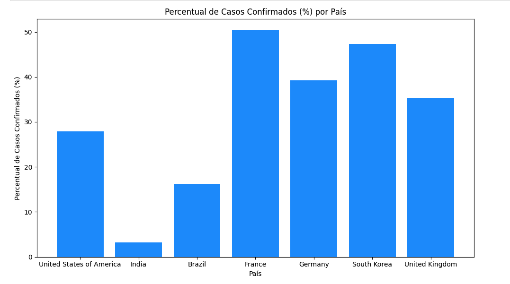
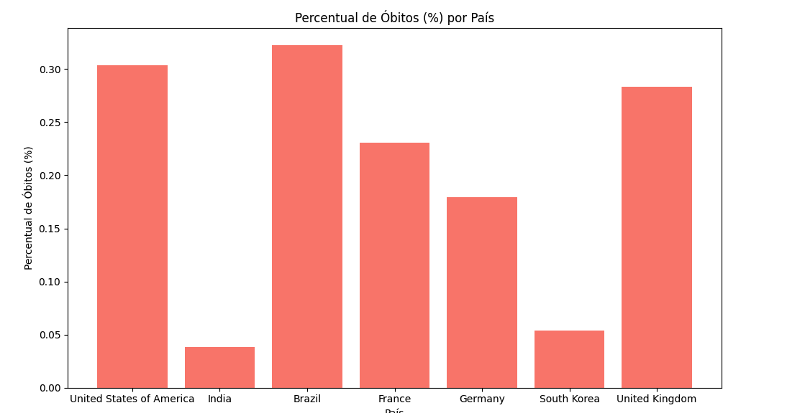
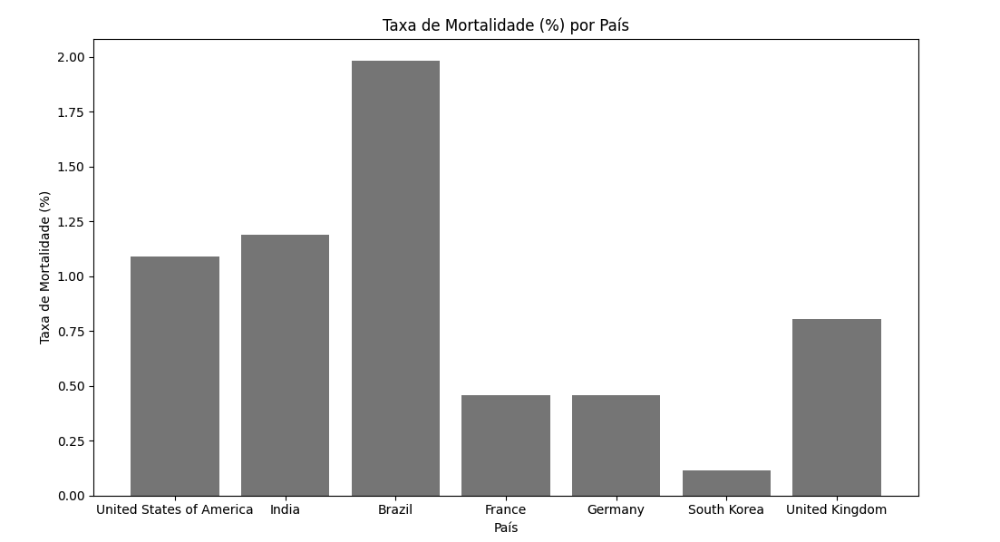

# Projeto de Pipeline ETL de Dados de COVID-19

Este projeto foi desenvolvido para uma agência governamental com o objetivo de projetar e implementar um pipeline de ETL (Extract, Transform, Load) que extrai dados públicos de COVID-19, transforma-os e os carrega para análise na plataforma Databricks. O pipeline foi projetado para oferecer um processo de ETL eficiente e seguro, estruturado em camadas e implementado em Python e Spark.

## Objetivo do Projeto

O objetivo deste projeto é disponibilizar um pipeline de dados de COVID-19 capaz de extrair dados atualizados de uma fonte pública, transformar e organizar esses dados em diferentes camadas (RAW, Bronze, Silver e Gold), e permitir análises e visualizações descritivas. Os dados analisados ajudam a entender o impacto da pandemia, com métricas como número de casos, mortes, recuperações e outros indicadores-chave.

## Dados Utilizados
- Fonte de Dados: [COVID-19 Open Data](https://storage.googleapis.com/covid19-open-data/v3/latest/aggregated.csv)
- Estrutura: Dados agregados de COVID-19, incluindo contagens diárias de casos confirmados, mortes, recuperações e vacinação por região.

## Arquitetura e Camadas de Dados (Medallion Architecture)

O pipeline foi estruturado com base na arquitetura Medallion, que segmenta os dados em camadas para facilitar a limpeza, a transformação e a agregação:

- **Camada RAW**: Dados brutos, armazenados conforme extraídos da fonte. Utilizados como um backup seguro para manter a integridade dos dados originais.
- **Camada Bronze**: Dados convertidos para o formato Delta, com uma estrutura inicial para facilitar transformações posteriores.
- **Camada Silver**: Dados limpos e padronizados, com tratamento de valores nulos, conversão de tipos e normalização de colunas.
- **Camada Gold**: Dados agregados e sumarizados, com métricas e indicadores prontos para análise avançada.

## Implementação do Pipeline de ETL

### 1. Extração de Dados (`src/utils/functions.py`)
- **Função Principal**: `download_file_from_url`
- **Descrição**: Baixa o arquivo CSV de COVID-19 da URL pública e o salva no DBFS na camada **RAW**.
- **Objetivo**: Centralizar a extração de dados e assegurar que a pasta de destino esteja limpa para evitar duplicações.

### 2. Transformação de Dados (`src/utils/functions.py`)
Funções de transformação para mover e preparar os dados entre camadas:
   - **RAW para Bronze**: Converte o arquivo para o formato Delta, organizando os dados brutos.
   - **Bronze para Silver**: Remove valores nulos, padroniza tipos e normaliza colunas de mobilidade, tornando os dados consistentes para análises.
   - **Silver para Gold**: Agrega dados e calcula métricas chave, como taxa de mortalidade e recuperação, por país e período.

### 3. Notebooks de Transformação e Análise
Cada notebook executa uma etapa do pipeline e explora os dados nas diferentes camadas:
   - **01_data_extraction**: Executa a extração de dados e armazena na camada **RAW**.
   - **02_data_transformation_to_bronze**: Converte e move os dados para a camada **Bronze**.
   - **03_data_transformation_to_silver**: Processa e organiza os dados na camada **Silver**.
   - **04_data**: Realiza análise exploratória e cria gráficos dos principais indicadores.

### 4. Armazenamento no Databricks
- **Formato de Armazenamento**: Dados são armazenados em formato Delta, escolhido pela eficiência em consultas e pela capacidade de manipular grandes volumes de dados.
- **Justificativa**: O formato Delta permite versionamento, suporte a transações ACID e alta performance em consultas analíticas, o que é essencial para este projeto.


## Análise Gráfica dos Dados de COVID-19

### 1. Percentual de Casos Confirmados por País


Este gráfico mostra o percentual de casos confirmados em relação à população total para os países mais afetados.

### 2. Percentual de Óbitos por País


Aqui vemos o percentual de óbitos em cada país, o que permite uma visão comparativa da gravidade do impacto da COVID-19.

### 3. Taxa de Mortalidade por País


A taxa de mortalidade em relação aos casos confirmados é exibida aqui, dando uma perspectiva sobre a letalidade do vírus em cada país.

## Medidas de Segurança
### Durante o Processo de ETL
- **Autenticação e Credenciais**: Uso de variáveis de ambiente para proteger credenciais e evitar exposição direta no código.
- **Controle de Acesso**: Configuração de permissões para acesso aos dados de cada camada do pipeline, garantindo que dados sensíveis estejam protegidos.

### No Armazenamento dos Dados
- **Delta Lake**: Com transações ACID, garante que cada modificação nos dados seja rastreável e segura.
- **Isolamento de Camadas**: Separação entre camadas (RAW, Bronze, Silver e Gold) permite controlar quem pode acessar ou modificar dados em diferentes estágios.

## Monitoramento e Escalabilidade

### Estratégia de Monitoramento
O pipeline de ETL possui pontos de monitoramento para garantir que cada etapa do processo ocorra corretamente:
- **Logs de Execução**: Registro detalhado de cada etapa e erros ocorridos.
- **Métricas Chave**: Tamanho dos dados em cada camada, número de registros processados e contagens de dados ausentes.
- **Ferramentas de Monitoramento**: Logs e métricas configurados para monitoramento via Databricks e ferramentas de observabilidade.

### Eficiência e Escalabilidade
- **Uso do Spark**: O Spark permite processar grandes volumes de dados de forma distribuída, aumentando a eficiência do pipeline.
- **Formato Delta**: Com suporte para transações ACID, o Delta Lake facilita consultas rápidas e escaláveis para análises avançadas.

## Estrutura de Diretórios

```plaintext
/covid19/
├── README.md
├── requirements.txt
├── src
│   └── utils
│       └── functions.py
├── notebooks
│   ├── 01_data_extraction.ipynb
│   ├── 02_data_transformation_to_bronze.ipynb
│   ├── 03_data_transformation_to_silver.ipynb
│   └── 04_data.ipynb
├── config
│   ├── configs.py
│   └── spark_session.py
└── images
    ├── grafico_casos_confirmados.png
    ├── grafico_obtos_pais.png
    └── grafico_taxa_mortalidade.png
